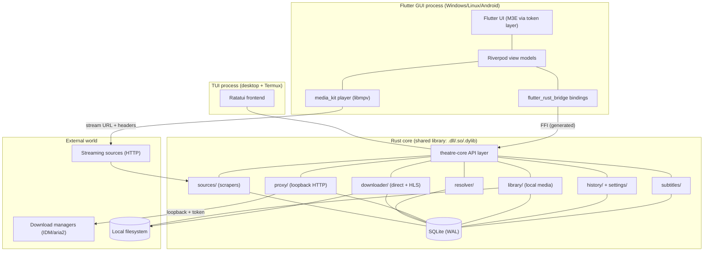

# architecture.md — Theatre

**Version:** 1.0
**Status:** Agent-ready. Companion to `prd.md` v1.1 (all product decisions resolved there). This document defines *how* Theatre is built; `data-contract.md` will define the exact Rust↔Flutter API surface.
**For AI agents:** Every structural decision is final unless it conflicts with `prd.md`. Do not introduce new frameworks, crates, or architectural patterns without updating Section 22 (Technology Decisions) and Section 24 (Deferred Items). Implementation order is in Section 23 — follow it.

---

## 1. Purpose

This document specifies Theatre's system architecture: process model, component boundaries, data flow, the Rust core's internal design, the FFI boundary, the download engine and proxy, state persistence, the TUI sibling, the Flutter app structure, testing strategy, and build/packaging. It exists so that AI agents and contributors make the *same* architectural decisions the project would make — without improvising.

## 2. System Overview



One Rust core library serves two frontends. The Flutter GUI embeds it via `flutter_rust_bridge`【turn0search8】; the TUI links it directly. All state flows through SQLite; all network scraping flows through the sources layer; all downloads (in-app and proxy) flow through one downloader pipeline.

## 3. Process Model

| Property | Desktop (Win/Linux) | Android |
|---|---|---|
| Processes | **One** Flutter GUI process + optional TUI process (separate binary) | One Flutter GUI process; TUI exists only as a separate Termux install |
| Rust core location | `theatre_core.dll` / `libtheatre_core.so` loaded in-process via FFI | `libtheatre_core.so` per ABI inside the APK, loaded via FFI |
| Proxy lifetime | While GUI runs; optional minimize-to-tray keeps process alive | While GUI runs; foreground service keeps process alive during active downloads/proxy sessions |
| Multiple instances | **Forbidden.** Named mutex (Windows) / lockfile (Linux) on startup; second launch signals first to focus its window and exits | N/A (OS enforces) |
| TUI state sharing | TUI opens the **same SQLite DB** (WAL) — history/settings/queue shared live | **Not shared.** Termux sandbox is a separate app; TUI on Android uses its own data directory. Documented limitation, not a bug to fix |

**Android process-death policy:** downloads run under a foreground service (`flutter_foreground_task` or equivalent【turn0search13】【turn0search15】) so OS kills are rare; on kill, the queue's persisted state resumes on next launch (Section 8).

## 4. Repository Layout

```
theatre/
├── docs/                    # prd.md, architecture.md, design.md, data-contract.md,
│                            # tech-stack.md, roadmap.md
├── AGENTS.md                # agent instructions (reads docs first)
├── core/                    # Cargo workspace: the Rust core
│   ├── crates/
│   │   ├── theatre-core/    # main library: sources, resolver, downloader,
│   │   │                    # proxy, library, history, settings, subtitles
│   │   └── theatre-ffi/     # flutter_rust_bridge-facing crate (thin, no logic)
│   └── Cargo.toml           # workspace root
├── tui/                     # Ratatui frontend (fork-extract of MovieBox-TUI),
│   └── ...                  # links theatre-core; its own binary target
├── app/                     # Flutter application
│   ├── lib/
│   │   ├── features/        # search/ details/ player/ downloads/ library/
│   │   │                    # history/ settings/ proxy/
│   │   ├── core/            # generated frb bindings, providers bootstrap
│   │   └── design/          # token layer wrapping M3E widgets
│   └── pubspec.yaml
├── vendor/
│   ├── ffmpeg/              # per-platform ffmpeg sidecar binaries (not source)
│   └── yt-dlp/              # (P1) desktop sidecar
├── scripts/                 # build, bundle, release helpers
└── .github/workflows/       # CI matrix + release pipeline
```

`theatre-ffi` is deliberately thin: it exists only so the frb-generated API is isolated from core internals — the core stays callable from the TUI without any Flutter-specific types.

## 5. Rust Core — Internal Design

`theatre-core` is one crate with strict module boundaries (agents: no cross-module reaches into private internals; go through `api/`):

| Module | Responsibility | Notes |
|---|---|---|
| `api/` | The public façade: types + functions exposed to FFI and TUI. Everything else is internal | The surface for `data-contract.md` |
| `sources/` | Scraper trait + per-source implementations (MovieBox, 4KHDHub, BDIX), search aggregation, health tracking | Extraction source: forked MovieBox-TUI (Section 15) |
| `resolver/` | Content ID → `ResolvedStream { url, headers, kind: Direct\|Hls, variants[] }` with re-resolve-on-expiry logic | Resolver chain: scrapers first; yt-dlp sidecar appended in P1 |
| `downloader/` | Queue, direct-HTTP range downloads, HLS segment fetch, remux orchestration, resume state | Single engine; the proxy is a *client* of this module |
| `proxy/` | Loopback HTTP server, session tokens, URL generation, spool serving | Built on `axum`/`hyper` (async); see Section 9 |
| `library/` | Library locations, folder scanning (lazy/async), missing-file detection, media-file filtering | Live view, no index — re-list on browse |
| `history/` | Watch history, resume positions, continue-watching queries | Keyed: metadata (streams) or path (local) |
| `subtitles/` | Subtitle provider search, download, format detection | Extraction source: MovieBox-TUI |
| `state/` | SQLite access (WAL, `busy_timeout=5s`), migrations, settings KV | One DB file; path per platform (Section 12) |
| `net/` | Shared HTTP client: per-host politeness semaphores, timeouts, header injection | All outbound HTTP flows through here |

**Async runtime:** `tokio`, started once at core init (`theatre_core::init()` from FFI/TUI). All `api/` async functions run on it; frb streams surface progress to Flutter.

## 6. FFI Boundary (flutter_rust_bridge)

- **Tooling:** `flutter_rust_bridge` v2【turn0search8】【turn0search6】, generating Dart from `theatre-ffi`.
- **Shape philosophy:** commands are `async fn` returning plain data; progress/events are Rust `Stream`s surfaced as Dart `Stream`s (download progress, source health changes, proxy session events).
- **Errors:** one `TheatreError` enum at the boundary with variants per module (`Source`, `Resolve`, `Network`, `Download`, `Proxy`, `Storage`, `Library`, `Subtitle`, `Internal`); no panics ever cross FFI — every `api/` function converts panics to `Internal` via `catch_unwind` at the boundary.
- **Threading rule:** FFI functions never block; they return futures or spawn onto the core runtime.
- The complete typed surface is **`data-contract.md`** — this document only fixes the philosophy. Agents must not invent ad-hoc types at the boundary; they go in the contract doc first.

## 7. Resolver Chain

```
resolve(content_id):
    for source in enabled_sources (parallel, per-source timeout 8s):
        candidate = source.resolve(content_id)        # url, headers, kind, variants
    if all failed → TheatreError::Resolve (with per-source detail)
    return best candidate (user-chosen source wins)
```

- Links are **never resolved at search time** — only at play/download/proxy-link generation (they expire).
- On 403/expiry at consumption time: one automatic re-resolve, then surface error if it fails again.
- P1 adds yt-dlp as the chain's terminal fallback (desktop): shell out with `--dump-json`, parse, wrap as a `ResolvedStream`.

## 8. Download Engine

**One engine, two consumers:** the in-app download manager and the proxy both enqueue jobs through `downloader/`. A job is:

```
DownloadJob {
    id, content_ref, variant, kind: Direct|Hls,
    dest_path, status: Queued|Preparing|Running|Paused|Failed|Done,
    progress: { bytes_done, total_bytes?, segments_done, total_segments? },
    resume_state: RangeOffset | SegmentIndex+RemuxPoint
}
```

**Direct pipeline:** HTTP GET with `Range` resume, streaming to `dest_path.<part>`, atomic rename on completion.

**HLS pipeline:**
1. Fetch playlist (+ variants), select per user choice.
2. Fetch segments sequentially (concurrency 2–3 per job), each with ≤3 retries + backoff; segment-403 triggers playlist re-resolve (transparent, per PRD).
3. Spool segments to `dest_path.<spool>` (concatenated TS/fMP4).
4. Remux via **ffmpeg sidecar** (Section 9.3): `ffmpeg -i spool -c copy -movflags faststart out.mp4` (MP4 when codecs allow; MKV fallback `-f matroska`). Progress parsed from `-progress pipe:1`.
5. Atomic rename; `.<spool>` deleted.

**Persistence:** every state transition writes to SQLite (`downloads` table); app/OS kill at any point resumes from `resume_state` on relaunch, including transparent re-resolve if the link expired while dead.

**Background:** Android runs an active-download foreground service (progress notification); desktop simply keeps running (tray option keeps the process without a window).

## 9. Download Proxy

### 9.1 Lifecycle & security
- Bind `127.0.0.1:0` (OS-assigned port) at core init; live port surfaced via FFI.
- Random 128-bit **session token** per app launch, embedded in every URL path: `http://127.0.0.1:PORT/d/<token>/<job-id>/<filename>`. Non-matching token → `403`. No directory listing. Tokens rotate on restart (old links die — PRD-mandated).
- External interface bind attempts are impossible: socket bound to loopback only.

### 9.2 Serving model
- **Direct files — pass-through:** proxy fetches upstream with auth headers injected and forwards bytes to the client, forwarding client `Range` headers upstream when the origin supports them. Minimal buffering; upstream 403 → re-resolve once → retry transparently.
- **HLS — spool & serve:** generating a link for an HLS title starts a proxy **prep job**: resolve → segment-fetch → remux into a cache spool file (same pipeline as Section 8). The HTTP handler serves the spool: `Range` requests within spooled bytes are served immediately; requests beyond the spool pace/block until bytes exist (backpressure). No `Content-Length` is advertised until the spool completes (managers show "unknown size," then total); connection close signals EOF. Client reconnect-with-Range resumes against the surviving spool. Prep jobs idle-continue while Theatre runs.
- **Session tracking:** active external sessions tracked in `proxy_sessions`; exit guard queries this via FFI before the UI closes (desktop dialog / Android notification). Sessions die at process exit by design.

### 9.3 FFmpeg sidecar (shared by downloader & proxy)
- Bundled **ffmpeg CLI binaries** per platform/ABI in `vendor/ffmpeg/` (desktop x64; Android arm64/armeabi-v7a/x86_64 — prebuilt binaries are readily available【turn0search9】), shipped inside the app package next to the core library. Invoked as a subprocess from Rust with piped stdio; the `ffmpeg-sidecar`-style wrapper pattern applies【turn0search11】.
- **Why CLI, not linked FFmpeg:** the libmpv bundle contains FFmpeg internals but exposes no remux API; a CLI sidecar is the same proven approach yt-dlp uses, debuggable, swappable, and license-clean (LGPL/GPL binaries kept at arm's length as separate processes).
- Remux only — `-c copy` — no transcoding in v1 (PRD non-goal).

## 10. Playback Integration

- **Engine:** `media_kit` + `media_kit_video` (+ modular `media_kit_libs_video` native libs【turn0search3】), one shared `Player` instance behind a Riverpod provider; player reuse across navigations (no dispose churn).
- **Streams:** Flutter asks the core to resolve, receives `ResolvedStream`, calls `player.open(Media(url, httpHeaders: headers))`. Auth headers flow core→Dart→media_kit per source.
- **Local files — desktop:** `player.open(file://…)` directly; sibling subtitles auto-load (mpv native behavior; also passed as `--sub-file`).
- **Local files — Android (⚠ spike S-1):** direct `content://` playback support in media_kit is unverified. Two implementation paths, decided by the spike: (a) media_kit accepts `content://` URIs → use directly; (b) it does not → the core resolves SAF documents to file descriptors/paths, falling back to copy-to-cache for playback. The architecture supports both; the spike (Section 24) must resolve this before the local-media milestone.
- **Track/subtitle switching:** exposed via `media_kit`'s track APIs; subtitle files from `subtitles/` loaded as external tracks.

## 11. Local Media & Storage

- **Library locations:** desktop = filesystem paths; Android = SAF folder grants (persistable URI permissions). Stored in `library_locations` table.
- **Browsing:** on browse, `library/` lists the folder live (async, cancellable); video/audio extensions filtered; deleted/moved entries surface "missing" gracefully. No scan database, no watcher — a browse *is* the refresh.
- **History:** local playback enters `history` keyed on the resolved path (PRD F5).

## 12. State & Persistence

- **Engine:** SQLite via `rusqlite` (synchronous, called from blocking-safe contexts) — WAL mode, `busy_timeout=5s` for cross-process safety (TUI + GUI).
- **Schema ownership:** `state/` owns migrations; versioned, forward-only, additive (PRD: never lose history/locations on upgrade).
- **Location:** desktop → OS data dir (`%APPDATA%/Theatre`, `~/.local/share/Theatre`); Android → app-private storage. One file: `theatre.db`. Settings are a KV table inside it (no separate config file to drift).
- **Tables (sketch — final in `data-contract.md`):** `history`, `downloads`, `library_locations`, `proxy_sessions`, `settings`, `source_health`.

## 13. TUI Architecture

- **Origin:** fork of `mesamirh/MovieBox-Tui` on GitHub; extraction plan: strip its scraping/subtitle/download internals, re-point them at `theatre-core`'s `api/`, keep its Ratatui frontend, keybindings, themes, and provider-switching UX. Upstream stays as a git remote for periodic scraper-fix cherry-picks (Section 15).
- **Binary target:** `theatre-tui`, built from the workspace; desktop installers bundle it beside the GUI; Termux build documented with its own install script.
- **Parity (PRD F7):** search, playback launch (external player via its existing model), history, downloads (queue/progress), proxy link display (prints URL to terminal; OSC-52 clipboard best-effort), local playback by path.
- **Android:** separate Termux install; **does not share the GUI's DB** (sandbox separation). Stated in-app/README as designed behavior.

## 14. Flutter App Architecture

- **Structure: feature-first.** `lib/features/{search,details,player,downloads,library,history,settings,proxy}` each with `controllers` (Riverpod providers) + `views` (widgets). Shared widgets live in `lib/design/`.
- **State: Riverpod** (`riverpod_generator`). View models call frb bindings; `StreamProvider`s wrap core event streams (download progress, source health, proxy sessions). One global `PlayerProvider` owns the shared `media_kit` player.
- **Design token layer (PRD F4):** `lib/design/` exposes Theatre-prefaced widgets (`TButton`, `TCard`, `TNavBar`…) implemented today on the `material_3_expressive` community package【turn1search6】; when official Flutter M3E ships, only `lib/design/` internals change. Feature code must never import M3E components directly.
- **Navigation:** GoRouter with adaptive shell — NavigationBar / NavigationRail / NavigationDrawer per window-size class (PRD F4).
- **Threading:** UI never blocks on core calls — everything is async via frb.

## 15. Scraper Sourcing Strategy

- **Fork, don't vendor.** `git remote add upstream https://github.com/mesamirh/MovieBox-Tui` on our fork; extract the scraper modules into `sources/`; track upstream monthly, cherry-picking scraper fixes (their 643-commit history shows active source maintenance【turn1fetch0】).
- **Scraper interface:** one `trait Source { search(); resolve(); details(); health(); }` — per-source impls stay isolated so one broken source degrades itself only (PRD F8).
- **Fixture-based testing:** every scraper ships recorded HTML fixtures; tests parse fixtures, never the live network (Section 19).

## 16. Concurrency Model

- One `tokio` runtime in the core (multi-threaded), owned by `api/`.
- FFI/TUI submit work via the `api/` async surface; no direct runtime handle leakage.
- Outbound HTTP: per-host semaphore (max 2 concurrent) + 500ms min-interval per host (PRD politeness).
- Downloads: queue concurrency default 3, user-configurable; proxy prep jobs draw from the same pool.
- UI: Flutter's own isolate model; frb streams hop threads safely.

## 17. Security Model

- Proxy: loopback bind, per-launch token, 403 on token miss, no listing (Section 9).
- No telemetry, no accounts, no network egress except: user-configured sources, subtitle providers, (P1) yt-dlp updates.
- Android permissions: network, foreground service, storage via SAF only (baseline); `MANAGE_EXTERNAL_STORAGE` evaluated in a future decision, not default.
- Subtitle files and scraped content treated as untrusted input (parse in Rust, validate sizes).

## 18. Error Taxonomy

`TheatreError` variants (FFI boundary): `Source{source, detail}` · `Resolve{detail}` · `Network{detail}` · `Download{job_id, reason, resumable}` · `Proxy{session, reason}` · `Storage{reason}` · `Library{path, reason}` · `Subtitle{reason}` · `Internal{panic_message}`.

Rules: every failure carries enough context for the UI to render PRD-specified states (degraded source, missing file, failed-at-resumable-point download). Panics never cross FFI. Retry policies live in the modules, not the UI.

## 19. Testing Strategy

| Layer | Tests | Rule |
|---|---|---|
| Scrapers | Fixture tests: recorded HTML → parsed results | **Never hit live network in CI.** Fixtures refreshed manually via a `scripts/refresh-fixtures` tool |
| Resolver | Expiry/re-resolve simulation with mock HTTP | 403→re-resolve→success; double-failure surfaces error |
| Downloader | Range resume, segment retry, remux orchestration (mock ffmpeg) | Kill-at-every-state resume matrix |
| Proxy | Integration: hyper client against real loopback server | Token 403, Range-on-spool, backpressure, exit-guard session tracking |
| FFI seam | Round-trip tests of every `data-contract.md` type | Contract is executable — regenerate fixtures when contract changes |
| Flutter | Widget tests on token-layer components; golden tests for adaptive layouts (compact/medium/expanded) | Feature tests mock frb bindings |
| TUI | Smoke: primary journey against a stub core | Manual matrix otherwise |

Device matrix (manual, pre-release): mid-range Android (arm64), old Android (armeabi), Windows 10/11 x64, two Linux distros.

## 20. Build, Packaging & CI

- **CI (GitHub Actions):** matrix — `ubuntu-latest` (Linux core + Flutter Linux + TUI), `windows-latest` (Windows core + Flutter Windows + TUI), Android job (cargo-ndk for 3 ABIs + Flutter Android). macOS job compiles core + runs tests only (portability guard, no packaging — PRD D2).
- **Android APKs:** per-ABI (arm64-v8a, armeabi-v7a, x86_64) with modular `media_kit_libs_video` + bundled ffmpeg sidecar per ABI; universal variant optional.
- **Desktop installers:** Windows installer (GUI + `theatre-tui.exe` + ffmpeg), Linux AppImage + deb (same contents).
- **Bundling rule:** ffmpeg sidecar sits beside the core library and is located at runtime relative to the library path — never from `PATH`.
- **Release:** tag-driven; CI attaches artifacts + SHA256SUMS; draft GitHub Release.

## 21. Performance Budgets

| Metric | Budget |
|---|---|
| Cold start → interactive UI | ≤ 2 s desktop, ≤ 3 s mid-range Android |
| Search (2 sources) → first results rendered | ≤ 5 s broadband |
| Resolve → first video frame | ≤ 3 s typical |
| Proxy link generation → first bytes served | ≤ 2 s (direct), ≤ 5 s (HLS prep start) |
| UI jank during download progress events | none — events throttled to 4 Hz at the core boundary |
| Memory idle | ≤ 250 MB desktop, ≤ 150 MB Android |

## 22. Technology Decisions

| Choice | Rationale | Alternatives rejected |
|---|---|---|
| flutter_rust_bridge v2 | Generates the whole Dart side; async + streams solved | Raw FFI (hand-written glue, error-prone for agents)【turn0search8】 |
| media_kit (+ libs) | Proven libmpv wrapper, modular native libs, header support【turn0search3】 | video_player (no headers/HLS robustness), mpv embedding from scratch |
| Tokio + axum for proxy | Async HTTP serving, mature, small API surface | sync servers (blocking), actix (heavier) |
| SQLite + WAL via rusqlite | Cross-process TUI/GUI sharing, zero-config | sled/redb (no cross-process), JSON files (concurrency) |
| FFmpeg CLI sidecar | Remux without linking C; yt-dlp-proven; per-ABI binaries exist【turn0search9】【turn0search11】 | ffmpeg C bindings (build + licensing pain), no remux (poor UX) |
| Riverpod | Best docs, codegen, agent familiarity | Bloc (boilerplate), setState (unscalable) |
| GoRouter | Adaptive shell navigation, deep links | Navigator 1 (manual), auto_route (codegen weight) |
| Fork + upstream remote for MovieBox-TUI | Free scraper maintenance flow | Vendoring (manual sync), rewrite (waste) |

## 23. Implementation Order (Milestones)

| M | Scope | Demoable outcome |
|---|---|---|
| M0 | Repo scaffold, `AGENTS.md`, CI skeleton, workspace + empty Flutter app | Green CI |
| M1 | **Seam prototype** (throwaway-grade): frb `search()` returning hardcoded JSON + media_kit plays a URL, desktop + Android | End-to-end FFI→UI→playback works |
| M2 | Core extraction from MovieBox-TUI fork: `sources/` + `resolver/` behind `api/`; fixture tests | Real search in Flutter |
| M3 | Playback vertical slice: resolve→play with headers, subtitles, history | Primary journey complete |
| M4 | Downloader (direct + HLS + ffmpeg sidecar) + queue UI + background service | In-app downloads work |
| M5 | Proxy: server, tokens, direct pass-through, HLS spool, link generation, exit guard, tray | IDM completes an HLS download |
| M6 | Local media: open-file, Library locations (SAF), history integration; **spike S-1 resolved** | Local library browses/plays |
| M7 | TUI: fork extraction, desktop bundling, Termux script | TUI runs the primary journey |
| M8 | Polish: settings completeness, themes, packaging, device matrix, release 1.0 | Shipped v1.0 |

M1 must complete before M2-M4 design is considered final (seam risk retired first — PRD risk table).

## 24. Deferred Items & Mandatory Spikes

| ID | Item | Resolution path |
|---|---|---|
| S-1 | media_kit + Android `content://` (SAF) playback support | Spike in M6 start: test `player.open(content://…)`; if unsupported, core-side SAF resolution + cache-copy fallback (Section 10) |
| S-2 | `MANAGE_EXTERNAL_STORAGE` vs SAF-only on Android | Post-M6 decision informed by S-1 UX; SAF stays baseline |
| S-3 | yt-dlp sidecar auto-update channel (P1) | Design in `data-contract.md` when F16 starts |
| — | macOS/iOS port | P2 per PRD D2; core compiles on macOS in CI as portability guard |

---
